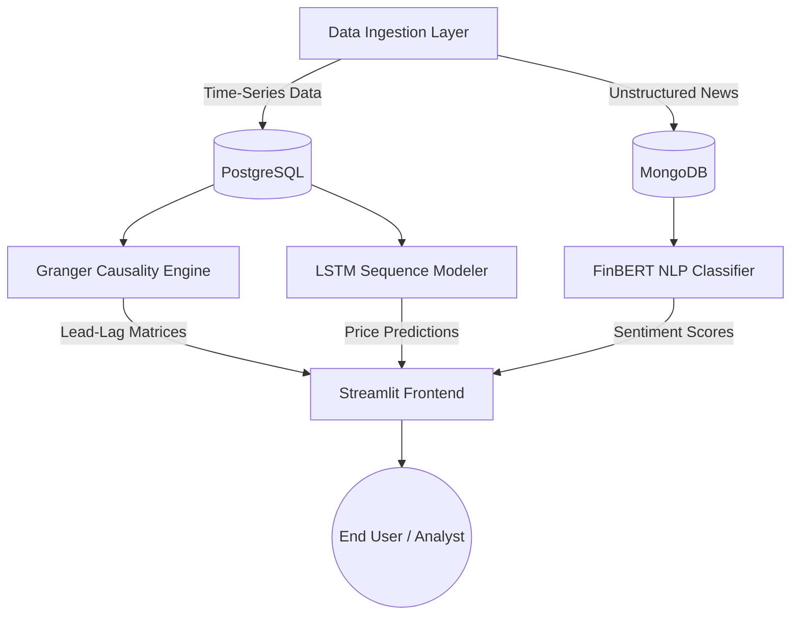

<div align="center">
  <h1>FinLagX: Financial Risk Intelligence Engine</h1>
  <p><strong>A high-performance temporal causality network and predictive analytics platform for global financial markets.</strong></p>

  <p align="center">
    
    
    
    
    
  </p>
</div>

---

## 1. Abstract

**FinLagX** is a comprehensive, end-to-end machine learning pipeline and interactive intelligence dashboard engineered to uncover, analyze, and predict the directional movements of global financial assets. Moving beyond traditional univariate forecasting, the system integrates **Statistical Causality Testing**, **Deep Sequence Modeling**, and **Transformer-based Natural Language Processing** to establish a holistic view of systemic market risks. The backend processing logic is surfaced to analysts via a high-fidelity, interactive glassmorphism UI.

---

## 2. System Architecture

The architecture of FinLagX is decoupled into distinct micro-processes, ensuring scalability across the data engineering, machine learning, and frontend application layers.



---

## 3. Core Methodologies & Algorithms

### 3.1. Statistical Causality (Granger Testing & VAR)
To move beyond spurious correlation, FinLagX employs **Vector Autoregression (VAR)** and **Granger Causality** tests to determine directional predictability between disparate asset classes.
- **Methodology:** The system analyzes 15 major global assets (e.g., Bitcoin, USD/CNY, Nasdaq 100). It tests the null hypothesis that past values of Asset X do not help in predicting the future values of Asset Y.
- **Output:** Relationships that pass a strict significance threshold (`p-value < 0.05`) are compiled into a directed graph matrix, highlighting key "Systemic Leaders" within the macroeconomic network.

### 3.2. Deep Sequence Modeling (LSTM & TCN)
For the prediction of continuous asset returns, the system utilizes advanced recurrent architectures:
- **Long Short-Term Memory (LSTM):** Selected for its ability to mitigate the vanishing gradient problem, the LSTM network processes historical sliding windows of asset features, capturing long-term temporal dependencies.
- **Temporal Convolutional Networks (TCN):** Implemented for parallelized processing of sequential data using causal and dilated convolutions, allowing for expansive receptive fields without recurrence.
- **Evaluation:** Models are rigorously evaluated using Purged Walk-Forward Backtesting to prevent data leakage, optimizing for Root Mean Square Error (RMSE) and Directional Accuracy.

### 3.3. Natural Language Processing (FinBERT)
Market movements are highly susceptible to qualitative news catalysts. 
- **Architecture:** The pipeline leverages a pre-trained HuggingFace Transformer model (`ProsusAI/finbert`), specifically fine-tuned on financial corpora.
- **Inference Pipeline:** Live news headlines are tokenized and processed through the attention layers, outputting softmax probabilities that classify the prevailing sentiment as **Positive**, **Negative**, or **Neutral**.

---

## 4. Frontend Application Layer

The analytical outputs of the ML models are aggregated and served via a highly optimized **Streamlit** dashboard.

- **Design System:** The UI is constructed utilizing a custom CSS suite that implements a modern "Glassmorphism" aesthetic (frosted glass panels, deep indigo gradients, and hover-responsive metric cards).
- **Interactive Visualizations:** All charts and network graphs are rendered natively using `Plotly Graph Objects`, supporting real-time panning, zooming, and data filtering.
- **Asynchronous Caching:** Streamlit's `@st.cache_data` decorators are heavily utilized to prevent redundant database queries, ensuring sub-second page loads.

---

## 5. Repository Structure

```text
FinLagX/
├── .streamlit/
│   └── config.toml                # Global UI styling tokens and theme configurations
├── configs/
│   └── default_config.yaml        # System hyperparameters and environmental mappings
├── data/
│   └── results/                   # Cached inference outputs and Granger matrices
├── docs/                          # Comprehensive technical documentation
├── models/                        # Serialized deep learning checkpoints (.h5 / .keras)
├── pages/                         # Streamlit Application Views
│   ├── 1_Network_Analysis.py      # Directed graph visualizations of asset causality
│   ├── 2_FinBERT_Sentiment.py     # NLP ingestion view and interactive sandbox
│   ├── 3_Model_Architectures.py   # Technical deep dive into model hyperparameters
│   ├── 4_LSTM_Predictions.py      # Time-series forecasting and error distributions
│   ├── 5_Backtesting_Engine.py    # Walk-forward testing analytics
│   ├── 6_Comparison.py            # Cross-asset performance metrics
│   └── 7_Future_Scope.py          # Project roadmap
├── src/                           # Backend Application Logic
│   ├── data_ingestion/            # API polling scripts (YFinance, NewsAPIs)
│   ├── data_storage/              # ORM configurations for PostgreSQL/MongoDB
│   └── modeling/                  # Mathematical and Deep Learning training modules
├── utils/
│   └── dashboard_helpers.py       # Centralized UI state management and fallback mocks
├── app.py                         # Application Entry Point (Executive Summary)
├── docker-compose.yml             # Container orchestration for database layers
├── requirements.txt               # Strict package dependencies
└── run_complete_pipeline.py       # Orchestrator script for the end-to-end ML lifecycle
```

---

## 6. Environment Setup & Deployment

### 6.1. Prerequisites
- Python 3.11+
- Git
- Docker & Docker Compose (Required for local database instances)

### 6.2. Local Installation

**1. Clone the Repository:**
```bash
git clone https://github.com/krishhsuri/FinLagX.git
cd FinLagX
```

**2. Initialize Virtual Environment:**
```bash
python -m venv venv
# Windows:
venv\Scripts\activate
# Unix/MacOS:
source venv/bin/activate
```

**3. Install Dependencies:**
```bash
pip install -r requirements.txt
```

**4. Deploy Database Containers:**
To initialize the PostgreSQL and MongoDB layers for live data ingestion:
```bash
docker-compose up -d
```
*(Note: If the database instances are offline, the frontend application is engineered to gracefully degrade, falling back to highly realistic static mock data via `utils/dashboard_helpers.py` to ensure presentation continuity).*

### 6.3. Launching the System

**Execute the ML Pipeline:**
To process new data and retrain the predictive models:
```bash
python run_complete_pipeline.py
```

**Serve the Dashboard:**
To initialize the Streamlit server on `http://localhost:8501`:
```bash
streamlit run app.py
```

---

## 7. Core Team & Contributions

| Name | Role | Core Responsibilities |
| :--- | :--- | :--- |
| **Aryan Raj** | ML Architect & Frontend Engineer | Engineered the Deep Learning architectures (LSTM), developed the FinBERT NLP inference sandbox, and conceptualized/deployed the premium Glassmorphism Streamlit UI. |
| **Krish Suri** | Data Engineer & Backend Developer | Architected the data ingestion pipelines, constructed the PostgreSQL/MongoDB database schemas, and managed API integrations. |

---
<div align="center">
  <small><em>Designed for academic evaluation and research purposes. Do not deploy for live capital allocation without comprehensive independent validation.</em></small>
</div>
